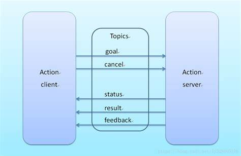

# RT1_Assignment3
# Submitted by Subhransu Sourav Priyadarshan & Supervised by Prof. Carmine Recchiuto

The assignment focuses on the development of a software architecture for the control of a mobile robot.

__AIM OF THE ASSIGNMENT__

In this assignment, we need to create a package in which the user will be able to use three different modalities in order to move the robot.

+ __autonomously__ reach a x,y coordinate inserted by the user
+ let the user drive the robot with the keyboard
+ let the user drive the robot assisting them to avoid collisions

We proceed in accordance with the instructions given to us beforehand (for example,setting the field goal and position coordinates, etc ) .


The software will rely on the `move_base` and `gmapping` packages for localizing the robot and planning the motion.

* The `move_base` package will provide an implementation of an *action* that, given a goal in the world, the robot will attempt to reach it with a mobile base. (Actions are services which are notexecuted automatically, and thus may also offer some additional tools such as the possibility of cancelling the request. 
* The `gmapping` pakage contains the algorithm based on a *particle filter* (approach to estimate a probability density) needed for implementing Simultaneous Localization and Mapping (SLAM). Needed by the `gmapping` package. 

The package will be tested on a simulation of a mobile robot driving inside of a given environment. The simulation and visualization are run by the two following programs: 

* **Rviz**: which is a tool for ROS Visualization. It's a 3-dimensional visualization tool for ROS. It allows the user to view the simulated robot model, log sensor information from the robot's sensors, and replay the logged sensor information. By visualizing what the robot is seeing, thinking, and doing, the user can debug a robot application from sensor inputs to planned/unplanned actions.

* **Gazebo**: It is a free and open source robot simulation environment. 

Given below is the Gazebo Environmnet:


__INSTALLATION AND SIMULATION__

The project runs on the ROS Noetic environment.

The simulation requires the following steps before running:

* A [ROS Noetic](http://wiki.ros.org/noetic/Installation) installation,

* The download of the `slam_gmapping` package form the *Noetic* branch of the [Professor's repository](https://github.com/CarmineD8/slam_gmapping.git )

Run the following command from the shell:
```bash
git clone https://github.com/CarmineD8/slam_gmapping.git
```

* The download of the **ROS navigation stack** (run the following command from the shell)

Run the following command from the shell:
```bash
sudo apt-get install ros-<your_ros_distro>-navigation
```

* And the and the clone of the [Current repository](https://github.com/subhransu10/RT1_Assignment3 ). After downloading the repository, you should take the `final_assignment` directory included in the repository and place it inside the local workspace directory.

Run the following command from the shell:
```bash
git clone https://github.com/subhransu10/RT1_Assignment3
```
The figure given below depicts the ROS-Action protocol:



The *Python* scripts I developed define a **user interface** that will let the user switch between driving modalities.
The **three scripts** provided are the following: 

+ goal_reaching.py
+ user_interface.py
+ teleop.py

__NODES DESCRIPTION__

__User Interface__

The first is the __User Interface__ that lets the user switch between the modalities, including the 'free' one (i.e. when no mode is active). The command is given by a user keyboard input and it is sent to the other nodes using ROS topics.Hence it can be seen that the node controls the driving capabilities of the robot. with the help of this node, the User will interact with the simulation choosing the driving mode through certain keyboard inputs (also depicted in the flowchart) .

Driving modalities related to their keyboard inputs are:

 + The keyboard input [0] resets the current driving modality.
 + The keyboard input [1] will start the autonomous drive towards a certain location in the map chosen by the user.
 + The keyboard input [2] is a manual mode without requiring any assistance.
 + The keyboard input [3] is a manual mode  requiring an assistance.
 + The keyboard input [4] will quit the process.


__Autonomous Driving__

The second script implements the __'Autonomous Driving modality'__ feature. The user will be asked to insert the __'x'__ and __'y'__ coordinates in which the robot will navigate. If the rquest cannot be fulfilled within 60 seconds the goal will be cancelled for which a 60 seconds timer is set. The user can also cancel the goal before the time is over, it is sufficient to return to the __'free'__ status by pressing '0' on the UI console.

__Manual Driving__

The third script implements both the Assisted and Without Assisted Driving. The script is essentially a __recurrence of teleop_twist_keyboard__ because this one already lets the robot move using keyboard inputs. Briefly, this last modality makes a subscription to /scan topic in order to check if a certain direction is free or if there is an obstacle (e.g. a wall in this case). We can also see that the robot can 'see' through its lasers only within a +-90 relative degrees range, so it won't be able to avoid an obstacle if it is moving backward. The user can quit both the modalities by pressing p from the teleop console, or alternatively by pressing another command from user-interface (also depicted in the flowchart).


__FUNCTIONS USED__

The following functions (& callback functions) are used in the goal_reaching.py script

The below Callback function is used to set goal position
```python
def goalpos_callback(v):
	
	global  x_des, y_des, pos_received
	x_des= v.x
	y_des= v.y
	pos_received=True
	
```

The Callback function is used to start the action
```python
def callback_active(): 

	rospy.loginfo("\nAction server is processing the goal...")
```

The Callback function when action is finished 
```python
def callback_done(state, result):


	global done_cb
	global goal_set
	if state == 3:
		print("Goal successfully achieved")
		done_cb = True
		return
	if state == 2:
		print("PREEMPTED")
		time.sleep(3)
		os.system('cls||clear') #clear the console
		print (msg1+msg2)
		return
	if state == 4:
		print("ABORTED")
		return
	if state == 5:
		print("REJECTED")
		return
	if state == 6:
		print("PREEMPTING")
		return
	if state == 7:
		print("RECALLING")
		return
	if state == 8:
		print("RECALLED")
		return
	if state == 9:
		print("LOST")
		return	
```

You can view the simulation below.


__FlowChart__


__Conclusion and Improvements__

In some cases the robot seems to not choose the best possible path. Hence, there can be a modification where the robot's direction can be manually adjusted while it is autonomously moving.
The other characteristics of the robot could be modified.The User Interface could be enhanced for a better user experience.Moreover, the robot can only see within+-90 relative degrees range, so avoiding obstacle while moving backward is a problem.


